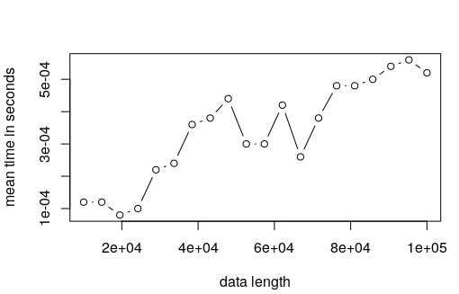
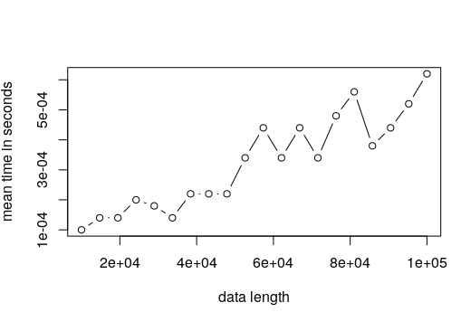

---
output:
  html_document: default
  pdf_document: default
---
# Projet 6 algorithmique: Alignement de séquences d'ADN
Etudiants:  
Mamadou KANOUTE  
Cédric Djiomou  
Minh-Quan Tran  

## Quick start

Le package `alignSeq` est un package permettant d'obtenir le meilleur alignement possible entre deux séquences d'ADN en s'inspirant de l'algorithme de **Needleman-Wunsch**.   
**Ce meilleur alignement est obtenu en prenant l'alignement qui donne le meilleur score**. 

L'algorithme utilisé **ne permet d'affirmer l'unicité de la solution** dû au fait qu'on peut avoir plusieurs alignements différents avec le même score.

L'algorithme de **Needleman-Wunsch** permet de passer d'une complexité exponentielle à une complexité **O(np)** avec **n** et **p** les longueurs des deux séquences, **contrairement à la version naïve de complexité exponentielle où on enumère tous les alignements possibles**.


## Installation du package

Pour une installation facile sous R, vous avez besoin du package devtools. Ensuite excécuter les 2 lignes de codes dans la console de R.

**devtools::install_github("kanoutemamadou/algorithmique")**   
**library(alignSeq)**


### Exemple inspiré de l'article sur Wikipédia
               
`A = GCATGCU`     
     `B =  GATTACA`    
     `d = -1`     
     `match = 1`      
     `dismatch = -1`       
     
Notons **p** la taille de la séquence A
**n** la taille de la séquence B.
Différentes étapes:
On crée une matrice de similarité S entre nos deux séquences.

`S_ij = 1 si A[i] = B[j]`           

`S_ij = -1 si A[i] != B[j]`         

`S_ij = -1 si on a un decalage, par exemple S[i] = - et S[j] = G, vice versa `                

Après on crée une matrice de taille (n+1)x(p+1) dont ses colonnes sont les éléménts de A, ses lignes les éléments de B, 

On l'appelle souvent `matrice F`.

#### Initialisation:
Les premières colonne et ligne de F sont remplies en commençant par 0, ensuite on enlève d.

F[1,1] = 0        
F[1,2] = F[1,1] + d ........ F[1,p] = F[1,p-1] + d      
F[2,1] = F[1,1] + d ....... F[n,1] = F[n-1,1] + d   


A partir de là, on remplit les colonnes au fur et à mesure en appliquant les formules suivantes:
```javascript
  top = F[i-1, j] + d
  
  left = F[i, j-1] + d
  
  topLeft = F[i-1, j-1] + S[A[i], B[j]]
  
  F[i,j] = max(left, top, topLeft)
```


  **Une fois, F entièrement construite, on cherche quel alignement donne le score maximal**.     
  Pour cela, on cherche le score maximal donné.On voit bien ici que c'est `F[n,p]`. 
  
  On part de cette position et on remonte vers la position (1,1), en regardant à chaque étape à partir de quel voisin on est parti.
  
  S'il s'agit de l'élément:
  
  - diagonal, `A[i] et B[j] sont alignés`.
  
  - à la position `(i-1,j)` alors `A[i]` est aligné avec un trou, c'est à dire le symbole   -.
  
  - à la position `(i, j-1)` alors `B[j]` est aligné avec un trou, c'est à dire le symbole  -.
  
  


Ainsi `Needleman.Wunsch<-function(d,A,B)` donne:

                         


## Version améliorée
C'est une version  améliorée de Needleman proposée par Lailil Muflikhah, Dian Eka R.                      
[Lien vers l'article](https://journal.utem.edu.my/index.php/jtec/article/view/1975).                  
Cette méthode consiste à ne remplir partiellement la matrice de score contrairement à la version originale de Needleman ouù on remplit complètement la matrice.                                             
Deux méthodes sont proposées en fonction de la longueur des deux séquences(même longeur ou de longueurs différentes).                                                                               
On s'interessera au cas où on a des séquences de même longeur. Dans ce cas on passe d'une complexité **O(mn)** à une complexité linéaire **O(n)**.

On remplit la diagonale, on prend ensuite les diagonales en haut en en bas comme illustré dans la figure suivante.


Les alignements sont:                                                                     


## Tests des deux versions codées en R et en C++

### Fonction de simulation
A partir de la fonction suivante, on crée deux séquences A et B à aligner

```{r}

match = 1
mismatch = -1
d = -1
n = 1000
SimulateSeq = function(n,m) {
  s <- sample(c("A","C","G","T"),size = n, replace = TRUE)
  snew <- s
  for(i in 0:m)
    
  {
    snew <- append(snew, sample(c("A","C","G","T"), 1), sample(length(snew), 1))
    snew <- snew[-sample(length(snew), 1)]
    snew[sample(length(snew),1)] <- sample(c("A","C","G","T"), 1)
    
  }
  s <- paste(s, collapse = "")
  snew <- paste(snew, collapse = "")  
  return (list(A=s, B=snew))  
}

v = SimulateSeq(n,1)
print(v)

```

On evalue ces algorithmes pour `n = 1000`

et nous obtenos les temps suivants:
```{r}
timeByFunction(n, match, mismatch, d, fun="V1_R")
```


```{r}
timeByFunction(n, match, mismatch, d, fun="V2_R")
```


```{r}
timeByFunction(n, match, mismatch, d, fun="V1_Cpp")
```


```{r}
timeByFunction(n, match, mismatch, d, fun="V2_Cpp")
```


## Comparaisons

```{r}
nbSimus <- 10
time1 <- 0; time2 <- 0; time3 <- 0; time4 <- 0

for(i in 1:nbSimus){time1 <- time1 + timeByFunction(n, match, mismatch, d, fun="V1_R")}
for(i in 1:nbSimus){time2 <- time2 + timeByFunction(n, match, mismatch, d, fun="V2_R")}
for(i in 1:nbSimus){time3 <- time3 + timeByFunction(n, match, mismatch, d, fun="V1_Cpp")}
for(i in 1:nbSimus){time4 <- time4 + timeByFunction(n, match, mismatch, d, fun="V2_Cpp")}
```


### Rcpp est au moins 51192  fois plus rapide que R pour nos deux algorithmes.
**Les différents temps**:     


```{r}
#gain R -> Rcpp
time1/time3
```


On remarque que la deuxième méthode est beaucoup plus rapide que la version originale.
```{r}
time1/time2
```


## Microblenchmark

Nous comparons `NeedlemanWunsch_Rcpp` et `NeedlemanWunschV2_Rcpp` pour n = 1000 et n = 10000.     

```{r}
n <- 1000
res <- microbenchmark(timeByFunction(n, match, mismatch, d, fun="V1_Cpp"), timeByFunction(n, match, mismatch, d, fun="V2_Cpp"), times = 50)
autoplot(res)
```


```{r}
res
```


```{r}
n <- 10000
res <- microbenchmark(timeByFunction(n, match, mismatch, d, fun="V1_Cpp"), timeByFunction(n, match, mismatch, d, fun="V2_Cpp"), times = 50)
autoplot(res)
```


```{r}
res
```


## Complexité en temps

```{r}
nbSimus <- 20
vector_n <- seq(from = 10000, to = 100000, length.out = nbSimus)
nbRep <- 50
res_Heap <- data.frame(matrix(0, nbSimus, nbRep + 1))
colnames(res_Heap) <- c("n", paste0("Rep",1:nbRep))

j <- 1
for(i in vector_n)
{
  res_Heap[j,] <- c(i, replicate(nbRep, timeByFunction(n, match, mismatch, d, fun="V1_Cpp")))  
  #print(j)
  j <- j + 1
}

res <- rowMeans(res_Heap[,-1])
plot(vector_n, res, type = 'b', xlab = "data length", ylab = "mean time in seconds")

```




```{r}
nbSimus <- 20
vector_n <- seq(from = 10000, to = 100000, length.out = nbSimus)
nbRep <- 50
res_Heap <- data.frame(matrix(0, nbSimus, nbRep + 1))
colnames(res_Heap) <- c("n", paste0("Rep",1:nbRep))

j <- 1
for(i in vector_n)
{
  res_Heap[j,] <- c(i, replicate(nbRep, timeByFunction(n, match, mismatch, d, fun="V2_Cpp")))  
  #print(j)
  j <- j + 1
}

res <- rowMeans(res_Heap[,-1])
plot(vector_n, res, type = 'b', xlab = "data length", ylab = "mean time in seconds")

```



